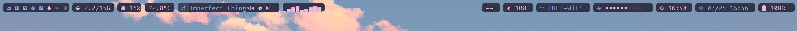

# lemonbar

## screenshot

## Usage

### Dependencies

- lemonbar
- lua
- xdotool (for workspaces)
- playerctl (for music)
- amixer (for volume)
- light (for backlight)
- powerprofilesctl (for powercontrol, optional)
- cava (for music visualization)
- tty-clock (optional)
- calcurse (optional)
- htop (optional)
- feh (for switching wallpaper, optional)

### Run

Set `launch.sh` as a auto-start sctrip in you window manager.

Remember to add `| bash` in order to get proper feedback for click/scroll actions.

### Configure

Edit `config.lua` to config the bar's height, font, font size, etc.

Edit `layout.lua` to config the layout for widgets.

Edit the first line of `widgets.lua` to change the theme.

## Actions

- Left click the numbers on the workspace widget to switch workspace.
- Right click the numbers on the workspace widget to move the focused window to the workspace.
- Left click the memory widget to run `htop`.
- The music widget supports media control (play/pause, next, previous).
- Left click on music or cava widgets to run a new terminal for `cava`.
- Left click the special widget to randomly switch wallpaper.
- Right click the special widget to switch wallpaper to default.
- Scroll up/down on the backlight widget to increase/decrease screen brightness.
- Scroll up/down on the volume widget to increase/decrease volume.
- Left click the wifi widget to run `nmtui`.
- Left click the volume widget to mute/unmute.
- Left click the time widget to run `tty-clock`.
- Left click the date widget to run `calcurse`.
- Right click the date widget to open a neovim todo markdown in default path.
- Left click the battery widget to switch to power-save mode.
- Right click the battery widget to switch to performance mode.
- Middle click the battery widget to switch to balanced mode.

## TODO

- [ ] Multi-screen adaptation.
- [ ] More themes.
- [ ] More functions.

## Acknowledgment

This repo is inspired by and adapted from [here](https://github.com/EdenQwQ/lemonbar)
